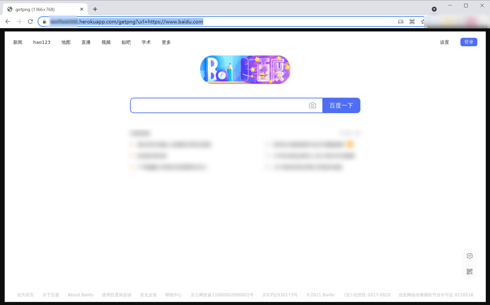

# 部署selenium 到 heroku

测试一下效果

# 笔记

Procfile

运行web服务
``` 
web: gunicorn run:app
```


运行python脚本
``` 
worker: python seleniumUtil.py
```

# 效果图
https://xxxxxxxxxxxx.herokuapp.com/getpng?url=https://www.baidu.com




[](https://heroku.com/deploy?template=https://github.com/duolabmeng6/heroku_selenium)
